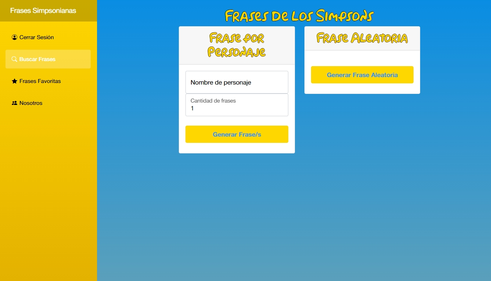
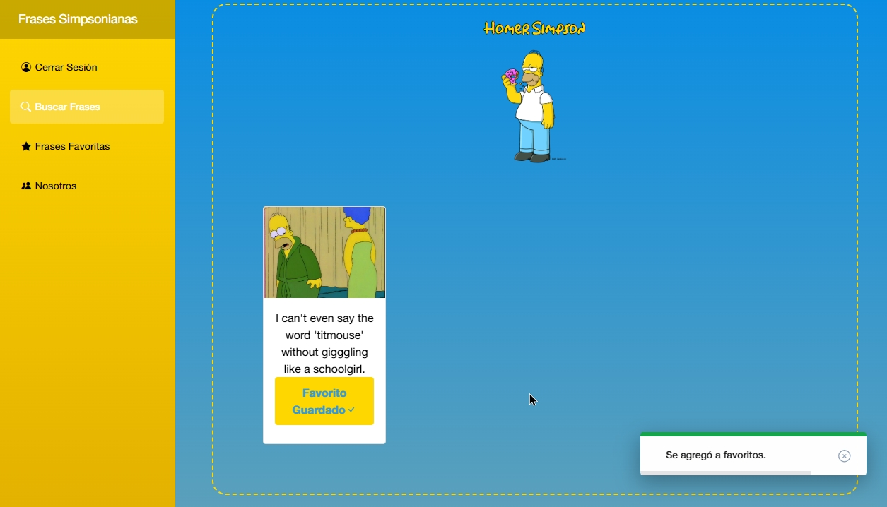
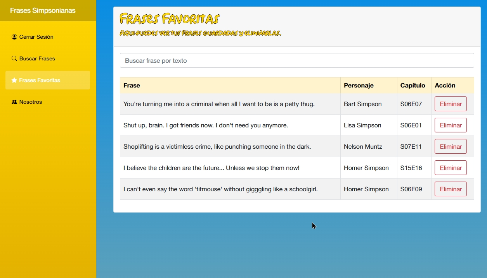
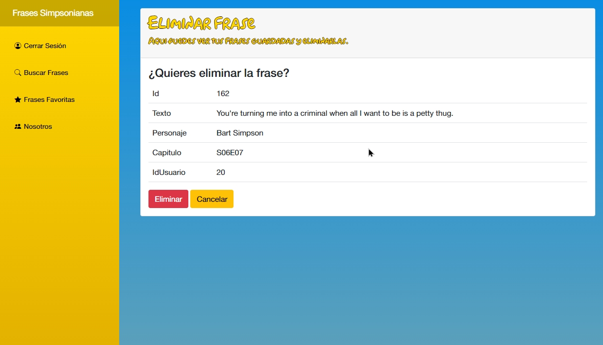

#  Frases Simpsonianas 

Bienvenido a Frases Simpsonianas, una aplicación web desarrollada en Blazor ASP.NET con .NET Core 6 que te permite buscar y gestionar citas de Los Simpson. El proyecto incluye características como registro y inicio de sesión de usuarios, menú de gestión de frases, y un buscador que permite encontrar frases por personaje o de manera aleatoria.

##  Uso
Puedes ingresar desde el siguiente link:
https://frasessimpsonianas.azurewebsites.net/

## 🚀 Instalación
1. Clona este repositorio: `git clone https://github.com/RacoTeam/ProyectoPADSimpson.git`
2. Abre el proyecto desde Visual Studio. Asegurate de tener .NET Core 6 instalado.
3. Ejecuta la aplicación desde el módulo Server.

## ⚙ Funcionalidades
- **Registro e Inicio de Sesión:** Permite a los usuarios crear cuentas y acceder a la plataforma.
- **Menú de Gestión de Frases:** Agrega, elimina y gestiona las frases de Los Simpson.
- **Buscador de Frases:** Encuentra citas por personaje o de forma aleatoria.

## 📸 Capturas de Pantalla

## 📖 Nosotros
Proyecto desarrollado para la materia Programación de Aplicaciones Distribuidas de 4to año en la UTN-FRT.
Desarrollado por:
- [Lucas Depetris](https://github.com/lucasdepetrisd)
- [Emanuel Haro](https://github.com/EmanuelHaro)
- [Santiago Figueroa](https://github.com/SantiFigueroa00)
- [Maribel Masucci](https://github.com/maribelmasucci)

---

¡Disfruta de Frases Simpsonianas y diviértete explorando las citas de Los Simpson!
